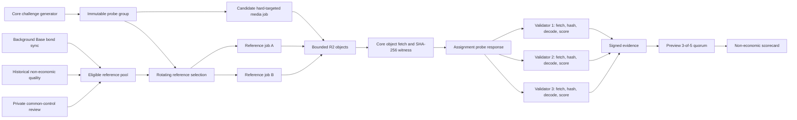

# Media Validation V1

**Status:** accepted design; deterministic image assignment, hard-targeted
three-worker execution, immutable Core witness hashing, and validator scoring
are implemented dark. Core and the validator also implement a separately gated
single-candidate `video.contract.v1` path. No production gate is enabled, and
reference-based video fidelity remains disabled.

This document defines the trust boundary for assignment-bound image and video
validation. It deliberately does not enable production media assignments,
worker penalties, validator rewards, or slashing. Core exposes the image route
but fails closed unless every operator, recipe, bond, and reference-pool gate is
explicitly configured. The current recipe catalog is non-deterministic and the
current eligible reference pool is empty, so the live behavior remains text-only.

## Objective

Validate what a media worker actually produced under a private, Core-issued
workload. Deterministic workflows can be checked for fidelity against rotating
reference workers. Non-deterministic workflows receive structural and contract
evidence, not a false claim of exact model identity.

This system does not prove subjective artistic quality, exact weights for a
non-deterministic model, GPU ownership, or operator independence by itself.

## Invariants

1. Core generates the prompt, seed, canonical recipe identity, and parameters
   with cryptographic randomness. The public validator binary contains no live
   prompt bank, seed schedule, golden output, or answer key.
2. One probe group stores one immutable challenge, one immutable reference
   selection, and one frozen three-output witness set. Candidate and references
   execute once per group; every assigned validator independently fetches and
   scores those same bytes.
3. Candidate and references execute the exact same canonical media contract.
   A checkpoint name alone is not a contract: model digest, recipe root,
   sampler, scheduler, steps, dimensions, seed, and temporal parameters are
   bound where the workflow supports them.
4. A media probe never reserves customer credit, pays den, writes a completion
   ledger row, applies a strike, changes routing, or touches a bond.
5. Core computes output SHA-256 from the stored R2 object. A worker-reported
   digest is metadata and cannot authorize evidence or payout.
6. Validators download only from operator-configured HTTPS origins, disable
   redirects, enforce byte/time/content-type bounds, recompute SHA-256, and
   reject any mismatch before decoding.
7. Candidate and reference workers each require a fresh, identity-bound,
   maintainer-reviewed common-control record. Their three opaque control groups
   must be distinct; distinct accounts and payout wallets remain defense in
   depth. The candidate cannot be its own reference.
8. At least two references must agree before the candidate is compared. A
   reference disagreement is `inconclusive`, never a candidate failure.
9. Reference selection rotates per group. No worker, wallet, account, host, or
   permanent allowlist is the sole oracle.
10. Evidence remains non-economic until independent operators, dispute handling,
    and objective-fraud policy are proven under load.

## Data Flow



Hot inference does not call Base. Bond state reaches Core only through a
background finalized-block sync and a durable cache.

## Durable Records

### Reference eligibility

Core has a dark `grid_validator_reference_workers` record keyed by
`(worker_id, model, modality)`. It carries:

- worker, account, and payout-wallet attribution;
- `active`, `paused`, or `revoked` status;
- bond contract, chain id, finalized block/hash, routed facet address/runtime,
  amount, active/slashed flags, verifier version, status reason, and
  verification timestamp;
- qualifying non-economic quality window and review timestamp;
- creation/update timestamps and a reason for every status change.

Eligibility is derived, not self-declared. The background sync must verify the
configured Base chain, reviewed registry address and runtime code, finalized
block, minimum bond, active status, and non-slashed status. A stale, missing, or
ambiguous bond snapshot removes the worker from selection without affecting
ordinary production routing.

Migrations `0023`, `0027`, and `0028`, `services/validator_references.py`, and the default-off
`services/validator_bonds.py` background loop implement the durable record,
finalized bond refresh, and fail-closed identity/freshness/rotation selector.
The sync queries two distinct Base RPC providers, pins both to their newest
mutually finalized block, and requires exact agreement on that block hash and
complete snapshot. For each source it verifies
the configured Grid Diamond, requires all 16 reviewed WorkerRegistry selectors
to resolve to one facet, pins that facet's runtime hash, and reads only the
distinct payout wallets already present in the reviewed reference table at one
finalized block. It never scans the registry-wide append-only worker history, so
historical worker growth cannot exhaust the bounded reference sync. The sync
updates only reference rows created by a separate review process; chain state
alone never creates or activates a trusted reference. The dark image
assignment path calls it in the same transaction that persists the immutable
probe group. Insufficient or ambiguous references produce no assignment.

The maintainer workflow is deliberately two-step and preview-first. Run
`scripts/review_validator_reference.py --action review` to record a bounded
quality window in a paused row, allow the background sync to attach the exact
finalized chain proof, then preview and digest-apply `--action activate`.
Activation uses the same configured chain, Diamond, code-reviewed verifier and
runtime, minimum bond, and quality threshold as assignment selection. The tool
cannot write positive bond evidence. A worker identity change pauses the row,
clears stale cached proof, and requires another chain sync; revocation is
terminal.

### Common-control review

`grid_worker_control_reviews` is a separate private record keyed by worker id.
It snapshots the current account and payout wallet, assigns one opaque `opg_*`
group for common practical control, records a non-sensitive review reference,
and expires. It is deliberately separate from model/modality quality and bond
state: one operator controls a worker across every recipe it serves.

Use `scripts/review_worker_control.py` in preview mode, inspect the identity and
proposed group, then apply only with the exact returned digest. Every worker
under common control receives the same group even if it uses another account,
wallet, host, or company label. Group ids and review references must contain no
names, emails, hostnames, IP addresses, wallets, or private notes. They are not
returned by assignment, scorecard, or public-health APIs.

Migration `0028` intentionally performs no eligibility backfill. A missing,
expired, rejected, revoked, future-dated, or identity-mismatched review fails
closed. Reference activation requires a fresh matching review, and group
creation locks the selected review state transactionally. The record does not
change routing, payout, rewards, bonds, strikes, or slashing.

`0027` also adds one durable sync cursor per `(chain_id, bond_contract)`. Core
anchors every later provider read to the previously accepted finalized block
hash, serializes multiple Core replicas with a PostgreSQL advisory transaction
lock, and commits the cursor plus refreshed reference proofs atomically. RPC,
route, runtime, snapshot, or finality-anchor disagreement immediately clears
eligibility for that authority and marks the cursor faulted. A later exact
two-provider sync can recover it. Rows attached to another registry are never
updated or invalidated.

The currently deployed WorkerRegistry does not yet provide the reviewed
cooldown-backed bond contract required by this design. The sync defaults off,
its address/version configuration defaults empty, and no operator-supplied
runtime hash is trusted. The reviewed candidate verifier is
`worker-registry-v2-7d7a2e8`, pinned in Core to runtime hash
`0x359fb8372a292a77fe76d156bbda39b35c3170f1ff0edaa1874ea8b87ee3af78`.
The historical `worker-registry-v2-957685a` candidate remains recognized only
with its distinct pinned runtime; verifier labels are not interchangeable.
Until the
facet is independently reviewed, cut, verified, and the sync is dark-canary
proven, the eligible reference pool is empty.

Migration `0024` adds the group execution lease, bounded attempt counter,
frozen witness JSON, full-witness commitment, and completion timestamp. This
prevents a five-validator quorum from multiplying one three-worker challenge
into fifteen GPU generations. A fresh lease has one executor; concurrent
validators wait for its committed result, and a stale lease can be reclaimed
within the same bounded retry budget.

### Media challenge

The existing probe-group `challenge` JSON can carry the V1 contract without
adding raw media bytes to SQL:

```json
{
  "schema": "aipg.validator.media.challenge.v1",
  "kind": "image.fidelity",
  "modality": "image",
  "prompt": "private generated prompt",
  "seed": 123,
  "model": "canonical model id",
  "model_digest": "sha256 hex",
  "recipe_id": "canonical recipe id",
  "recipe_root": "sha256 hex",
  "parameters": {
    "width": 1024,
    "height": 1024,
    "steps": 12,
    "cfg_scale": 1.0,
    "sampler": "euler",
    "scheduler": "normal"
  },
  "reference_worker_ids": ["uuid-a", "uuid-b"],
  "scoring_policy_id": "image.fidelity.v1"
}
```

The SQL challenge hash binds the complete object, selected references, target,
model, and group id. Assignment responses expose only what an independent
validator needs to reproduce scoring; they never expose account ids, bond
amounts, private operator labels, or Core's verdict.

### Output witness

Each candidate/reference output is returned as a bounded witness:

```json
{
  "role": "candidate",
  "worker_id": "uuid",
  "url": "https://approved-media-origin/...",
  "sha256": "Core-computed digest",
  "bytes": 123456,
  "content_type": "image/webp",
  "latency_ms": 1842
}
```

The evidence hash commits the ordered witness list plus assignment id, group id,
nonce, target, model, modality, capability, and challenge hash. URLs are transport
locations, not identities; the byte digest is the output identity. `latency_ms`
is measured by Core across accepted dispatch through terminal output, never
copied from worker-reported metrics, and is required for the candidate witness.

## Reference Selection

Selection runs when a group is created and is committed for the life of that
group.

1. Start from active, fresh, bond-verified records matching model and modality.
2. Join live worker state; an offline reference is ineligible for a new group.
3. Require a fresh identity-bound control review for the candidate and every
   possible reference.
4. Exclude the candidate worker, account, payout wallet, and control group.
5. Exclude references sharing a control group, account, or payout wallet with
   one another.
6. Require at least two eligible references and use `secrets.SystemRandom` to
   sample without replacement.
7. Apply a bounded recent-use penalty before random selection so the same pair
   cannot dominate successive groups.
8. Persist the selection. Never replace one reference silently after any output
   exists; fail the group as inconclusive and create a new group.

IP diversity may be monitored as a weak operational signal, but IP address is
not identity or proof of independent control.

## Probe Execution

Core dispatches candidate and references through the ordinary media worker
protocol with opaque UUID job ids and hard target affinity. Validator markers,
group ids, nonces, and reference roles are stripped before a worker sees the
payload. Jobs use dedicated validator upload prefixes and short retention.

The three GPU jobs run once per probe group, not once per validator assignment.
Core commits the complete ordered witness record, including transport URLs,
before releasing it. Each assignment then derives its own nonce-bound evidence
hash from that shared record; validators still fetch, hash, decode, and score
independently.

The worker initially uploads to an ordinary UUID-scoped slot. Core then copies
the object to a `validator/` key for which the worker never received a PUT URL,
fetches that frozen copy, computes SHA-256, and deletes the mutable source. The
validator URL points only to the frozen copy. A worker-reported digest is
required as transport hygiene but never becomes the witness digest.

The validator-media terminal handler must:

- presign exactly one bounded output slot per execution;
- require the expected content type and size range;
- fetch the completed object through the storage API;
- compute SHA-256 itself;
- publish an economically inert witness;
- acknowledge the worker with `den: 0`;
- never call `credits.record_and_settle`, `ledger.record_completion`, strike,
  payout, or slashing code.

Dispatch failure, storage failure, timeout, or reference disagreement is
inconclusive. An accepted target job that returns no object, malformed bytes, the
wrong dimensions, or a digest mismatch may produce failed evidence.

## Image Scoring

`image.fidelity.v1` is valid only for a recipe whose governed metadata declares
deterministic fidelity support. The independent validator:

1. verifies origin, size, content type, and SHA-256 for all three objects;
2. decodes each image and checks exact dimensions;
3. rejects blank/solid output and obvious decode corruption;
4. computes pHash for both references;
5. requires the references to be within the policy tolerance;
6. compares the candidate pHash with both reference hashes;
7. records distances and latency in the signed evidence commitment.

SSIM or LPIPS may be added as separate capability-gated policies. They must not
silently change the meaning of `image.fidelity.v1`.

Consensus-affecting pHash, motion, and latency thresholds are immutable public
constants of the scoring-policy version. They are not validator-operator
configuration. Changing one requires a new policy id and a staged capability
rollout. Local fetch, byte, decode-time, and process-memory limits remain
operator configurable because exceeding them yields `inconclusive`, never a
worker verdict. V1 fixes image pHash distance at 12 and image latency at 60
seconds; video fidelity fixes frame pHash distance at 12 and mean motion delta
at 8, while both V1 video policies classify latency above 120 seconds as slow.

For non-deterministic image recipes, `image.contract.v1` checks decoding,
dimensions, format, non-blank output, explicit seed transport, and latency. It
must not claim model-fidelity certification from pHash.

## Video Scoring

`video.contract.v1` uses a bounded local decoder capability and verifies:

- container decodes with no external URL or codec fetch;
- resolution, duration, fps, and frame count are within explicit tolerances;
- first, middle, and last keyframes decode;
- motion exists when requested, using pHash distance and a bounded motion
  statistic;
- the output is not a repeated still or a truncated first-frame loop.

`video.fidelity.v1` is reserved for governed deterministic or semi-deterministic
recipes. It additionally compares the candidate's sampled keyframes and motion
profile with two agreeing references. Prompt relevance remains a supporting
signal unless the challenge encodes an objective event that can be measured.

Validator binaries advertise image/video capabilities only when their optional
decoder dependencies are present and a local media-origin allowlist is set.

## Quorum And Outcomes

Media uses the existing one-vote-per-validator-per-group and 3-of-5 identity
quorum. `healthy`, `slow`, and `failed` are votes. `inconclusive` is a probe
outcome, not a vote, and does not count toward acceptance or dispute.

Reference disagreement, unavailable references, unsafe URLs, missing decoder
capability, or coordinator/storage failure must be inconclusive. This distinction
prevents infrastructure faults or a bad oracle set from becoming a worker
penalty.

## Runtime Gate

`VALIDATOR_MEDIA_PROBE_ENABLED=0` is the media master default. Enabling it is still
insufficient: Core also requires a valid chain id, reviewed bond-contract
address, verifier version, positive minimum bond, bounded quality threshold,
positive object-size/timeout limits, a registered validator advertising
`image.fidelity.v1`, an on-chain RecipeVault recipe id, deterministic metadata,
a 32-byte `modelDigest`, exact prompt/seed/width/height controls, and two fresh
independent references. Candidate and references must also have three fresh,
identity-bound, distinct worker-control groups. Any missing condition yields no
image assignment.

Video has an independent `VALIDATOR_VIDEO_PROBE_ENABLED=0` gate and also
requires the media master gate, positive byte/timeout bounds, a validator
advertising `video.contract.v1`, and an on-chain RecipeVault text-to-video recipe
with explicit prompt, seed, width, height, seconds, and fps variables. It runs
one candidate and commits one Core-frozen MP4. It does not select references or
claim model fidelity. Missing or ambiguous timing metadata yields no assignment.

### Read-only rollout preflight

Run the preflight from the exact immutable Core release with production env
before changing either assignment flag:

```bash
.venv/bin/python scripts/check_validator_media_readiness.py \
  --lane image --sync-recipes --require-ready
```

The command opens PostgreSQL with `default_transaction_read_only=on`, reads
Redis worker status without pruning or mutation, loads the curated catalog and
optionally its configured RecipeVault snapshot, and evaluates each candidate
with `preview_reference_workers`. That preview shares the production selector's
bond, freshness, quality, identity, common-control, account, wallet, online,
and model rules, but takes no row locks and does not update reference rotation
counters. Assignment creation still rechecks every condition under transaction
locks and commits the selected set with the probe group.

The report exposes model-level counts and generic blockers only. It omits
validator and worker identities, wallets, control groups, review references,
prompts, nonces, and witness locations. `ready_to_enable=true` means the lane is
eligible for a supervised evidence-only canary. It does not authorize routing,
rewards, strikes, payouts, bond changes, or slashing.

## Rollout Gates

All gates are required before an operator enables production image assignments:

- reviewed cooldown-backed WorkerRegistry facet deployed and code-verified;
- background bond sync with finalized-block, chain-id, Diamond selector-route,
  code-pinned facet runtime, durable block-hash anchor, multi-replica lock,
  bounded reviewed-wallet reads, immediate fault invalidation, recovery,
  freshness, stale-write, and reorg/finality tests;
- at least two independently operated Base RPC sources (or one independently
  verified local node plus a second provider) agreeing on one mutually finalized
  block hash and bond snapshot before the cache is production-authoritative;
- at least three independently controlled bonded workers on each validated
  model, providing one candidate plus two references, with fresh reviewed
  common-control records assigning three distinct opaque groups;
- reference-pool schema, rotation, independence, and ambiguity tests on real
  Postgres;
- validator media-origin allowlist and redirect/size/MIME/hash defenses tested;
- Core-computed R2 digests and validator recomputation tested with corrupted and
  swapped objects;
- image and video scoring policies versioned and fixture-tested across supported
  platforms;
- end-to-end probes prove zero credit, den, ledger, strike, payout, and bond
  side effects;
- console labels all media evidence preview/non-economic;
- supervised preview with at least five reviewed independent validator
  operators and no unexplained scorer divergence.

Only after those gates and a dispute process are proven may routing consume the
scorecard. Rewards and slashing remain a separate Base-governance phase.
