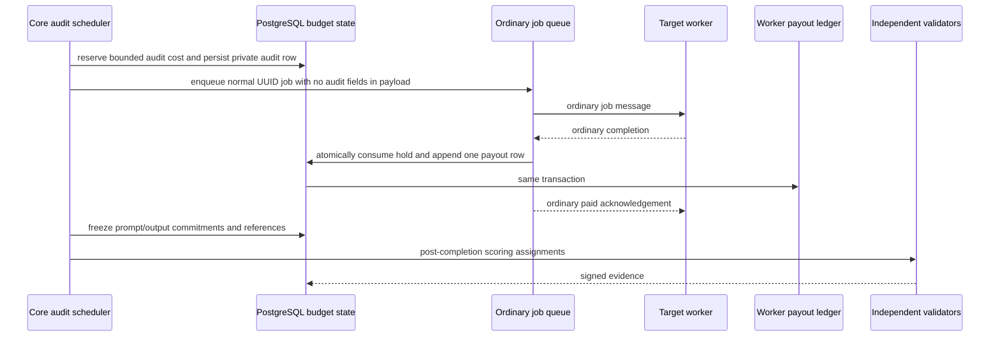

# Paid Validator Audit Rail

## Status

Accepted implementation contract. The schema, Alembic `0029`, four-scope budget
lifecycle, ordinary payout-ledger terminal, exclusive demand/audit locking, and
ledger-aware expiry recovery are implemented in source and remain dark. The
worker terminal treats a pre-existing audit hold as ordinary paid text, media,
or passthrough work. No scheduler, dispatch caller, configuration flag, corpus
selector, or validator scoring integration exists, so Core still cannot create
compensated audit traffic.

Current assignment-bound probes remain economically inert and return a
worker-visible `den: 0` terminal acknowledgement. They measure protocol
conformance and capability only. This document defines the separate rail needed
for production-shaped, compensated audits; it does not promote existing probes
to quality evidence.

The implemented foundation proves atomic reservation across global, worker,
reviewed-validator, and validator/worker-pair UTC-hour counters; exactly-once
settle/release movement; demand-reservation exclusion; payout-plus-budget atomic
commit; ledger-aware recovery; identical ordinary versus audit worker frames and
nonzero acknowledgements; and real PostgreSQL cap, same-job, dual-hold, terminal,
and settle/release races. It cannot issue work by itself.

## Purpose

Run bounded synthetic or explicitly consented audits through the ordinary worker
execution and payout lifecycle without charging a customer, revealing validator
metadata to a worker, or granting validators control over free inference.

The first deployment remains dark and evidence-only. Routing, validator rewards,
worker strikes, bonds, and slashing may not consume its results.

## Threat Model

Assume a worker controls its client, backend, model router, timing, and logs. It
can inspect every public prompt generator and route recognizable probes to a
strong backend. Assume a validator may replay work, collude with a worker, create
many accounts, exhaust budgets, or withhold evidence. Assume Core can crash at
every transition and multiple Core processes can race.

The rail must prevent:

- unlimited validator-triggered inference;
- a paid worker completion without a consumed protocol budget reservation;
- a consumed budget without exactly one worker payout ledger row;
- duplicate payout after queue reclaim, retry, or terminal replay;
- worker-visible assignment, validator, group, nonce, role, or audit markers;
- a special zero-den acknowledgement or timing shortcut;
- reuse of private customer content without explicit consent;
- one validator opinion becoming objective quality truth; and
- any quality result affecting routing or economics before promotion gates pass.

## Ownership And Data Flow

Core, not an individual validator, schedules an audit. The worker executes before
the selected validators receive the scoring assignment, so a colluding validator
cannot warn the target in advance.

`hard_target_worker` may remain private queue metadata because it is not sent
over the worker WebSocket. Audit identity must live only in a private database
row keyed by the ordinary job UUID. It must not appear in the queued payload,
worker job message, upload key, terminal acknowledgement, or worker log fields.

## Durable State

### Audit job

Add one private `grid_validator_audit_jobs` row per compensated execution. At a
minimum it binds:

- ordinary UUID `job_id` with a unique constraint;
- private audit/group identifiers;
- target worker, model, modality, and governed corpus/policy version;
- scheduler-selected validator seats, never a validator-supplied target;
- maximum reserved integer work units and actual integer work units;
- `held | queued | running | settled | released | manual_review` state;
- prompt/request commitment and frozen output commitment;
- creation, expiry, terminal, and review timestamps; and
- an opaque failure reason suitable for operations, not public scorecards.

No raw signing key, API key, customer identity, validator control group, private
review reference, or unrestricted prompt/output blob belongs in this table.
Synthetic corpus material may be stored in a separately access-controlled object
with bounded retention. Consented workloads require an explicit consent record
and irreversible account pseudonym; absence of consent fails closed.

### Budget counters

Use PostgreSQL counters, not process memory or Redis alone. Reserve against all
applicable scopes in one transaction and lock rows in deterministic order:

- global per UTC hour;
- target worker per UTC hour;
- reviewed validator seat per UTC hour; and
- validator/worker pair per UTC hour.

Budget values are integer micro-den work units. Convert the existing den formula
once, with an explicit rounding rule, and reserve the maximum possible amount
from prompt tokens, output limit, model multiplier, and modality parameters.
Floating-point sums are not an authorization boundary.

Each counter tracks `reserved` and `spent`. Reservation must compare
`reserved + spent + requested` with the configured cap while holding the row
lock. If any scope is absent, zero, exhausted, malformed, or unavailable, no job
is queued. Counters and the audit row commit together.

## Atomic Terminal

Extend the existing caller-owned terminal transaction rather than appending an
independent payout afterward. For an audit completion, one transaction must:

1. lock the held audit row;
2. verify job, worker, model, policy, state, and actual work units;
3. insert exactly one `grid_ledger` payout row using the ordinary den formula;
4. move each budget counter from reserved to spent;
5. mark the audit settled and freeze result commitments; and
6. commit before queue acknowledgement, worker acknowledgement, success metrics,
   or validator scoring assignments are published.

The demand reservation path and audit reservation path are mutually exclusive.
An audit job with a demand hold, or a normal paid job with an audit hold, is a
terminal integrity error. A missing, released, expired, or already-settled audit
hold cannot mint a worker payout. A duplicate committed terminal is a strict
no-op that returns the original paid status.

On a database error, do not acknowledge the queue or worker. Leave the message
for bounded stale reclaim. On a valid worker failure, release the audit hold and
write no payout row. A sweeper may release only an expired held row that has no
ledger completion; a ledger-aware conflict moves to `manual_review`, never an
automatic refund or second payout.

## Worker Indistinguishability

The compensated path must use the same worker handler and terminal shape as an
ordinary paid job:

- normal UUID format and model request;
- no `_validator_*`, audit, role, assignment, group, or nonce payload fields;
- identical streaming/progress behavior;
- identical output limits and timeout classes;
- normal den calculation and non-zero paid acknowledgement on success; and
- normal queue reclaim and duplicate-terminal behavior.

Passing these structural checks does not prove prompt indistinguishability. A
held-out worker-visible classifier evaluation must compare audit traffic with a
consented/synthetic production-shaped corpus and report recall, false-positive
rate, confidence intervals, and model-switching advantage. The live gate corpus
and labels must not ship in worker clients or public fixtures.

## Validator Boundary

Only active, heartbeat-fresh validators with a current independence review and
an explicit dark-canary allowlist may receive paid-audit scoring assignments.
Their signing wallet must still match the account-bound registration. Validators
cannot choose the worker, model, prompt, output limit, reference set, or budget.

The initial scoring assignment is post-completion and evidence-only. It carries
bounded frozen candidate/reference material or commitments and an exact policy
version. Objective structural checks are independently recomputed by Core.
Subjective rubric results remain validator opinions. No single vote creates a
quality score; quorum also requires distinct reviewed operator groups.

## Configuration

Implementation must ship with all of these controls fail-closed:

- a master paid-audit feature flag defaulting off;
- a separate blind-text-quality flag defaulting off;
- an explicit reviewed-validator canary allowlist;
- non-zero per-validator, per-worker, pair, and global hourly caps;
- bounded concurrency, output, timeout, retry, and retention limits; and
- a governed synthetic corpus/policy identifier.

An enabled flag with any missing budget, allowlist, corpus, or policy setting
must still issue no work. Configuration changes do not retroactively change a
held audit's frozen budget or policy.

## Required Tests

Before merge:

- SQLite lifecycle tests for reserve, settle, release, replay, expiry, and
  duplicate terminal behavior;
- PostgreSQL concurrency tests proving all four budget scopes cannot overspend;
- a real race between terminal settlement and stale release;
- atomic rollback tests for ledger insert, budget movement, and audit state;
- queue reclaim and process-crash recovery tests;
- worker-message and acknowledgement equality tests against ordinary paid jobs;
- malformed/missing/dual reservation rejection;
- reviewed-validator allowlist, suspension, expiry, and wallet-rotation tests;
- classifier, replay, template-solver, and model-switching tests; and
- migration fresh-upgrade, production-shaped upgrade, downgrade, and schema
  drift checks.

The source foundation and atomic-terminal changes cover the lifecycle,
PostgreSQL budget/terminal races, dual-hold rejection, rollback, expiry,
text/image/video settlement, and worker-message equality items. Scheduler queue
creation, scheduler-specific reclaim/crash tests, and held-out traffic classifier
evaluation remain gates for the later dispatch change; they are not bypassed by
the presence of terminal support.

Before production canary:

- complete Core CI, dependency, CodeQL, secret, and infrastructure scans;
- PostgreSQL backup/restore proof with the exact candidate release;
- one small allowlisted audit with budget and payout reconciliation;
- a duplicate/retry proof that creates no second payout;
- proof that the worker message and terminal contain no audit marker; and
- proof that routing, validator rewards, strikes, bonds, and slashing remain off.

## Rollout Gates

1. Merge schema, budget, atomic-terminal, recovery, and worker-transport tests
   with scheduling disabled. The source foundation for this gate is complete;
   no dispatch caller exists.
2. Dark-deploy `0029` and verify empty tables plus zero counters before starting
   the terminal-aware runtime; code-first deployment would break ordinary jobs.
3. Enable one reviewed first-party canary validator with tiny budgets; keep blind
   quality false and treat all results as operational evidence.
4. Reconcile each canary job against budget counters, worker ledger, payout
   period, queue terminal, and signed validator evidence.
5. Repeat under at least three independently reviewed validator operators.
6. Measure classifier resistance on held-out production-shaped traffic.
7. Only then propose `quality_eligible=true` in a separate reviewed change.

Routing influence, validator compensation, and worker penalties are later
decisions. Slashing remains restricted to objective reproducible fraud with a
dispute and appeal path. No Base transaction belongs in the inference hot path.

## Explicit Non-Solutions

- Paying the existing `_validator_probe` handler while retaining `den: 0` or a
  special terminal shape.
- Hiding public prompt templates while keeping the protocol recognizable.
- Letting validators submit arbitrary paid prompts or select targets.
- Charging a normal user account and refunding it later.
- Using Redis rate limits as the only budget authority.
- Recording worker payout and audit consumption in separate transactions.
- Treating registration, wallet count, or stake alone as operator independence.
- Enabling quality, routing, rewards, or slashing as part of the first canary.
