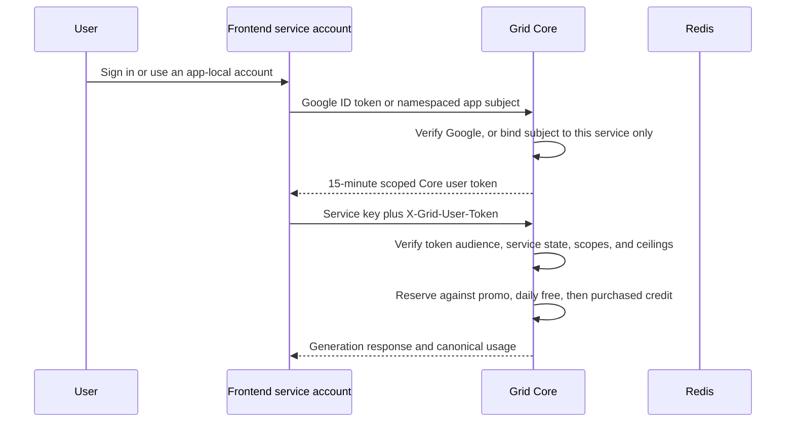

# Universal Grid Accounts

## Status

The Core schema, identity services, native short-lived user tokens, bounded
service clients, wallet-link flow, promotional grants, and three-pocket
reservation accounting are built and tested. They are ship-dark: promotional
and daily-free value do not pay for inference until their independent live
flags are enabled. The legacy internal session bridge is default-off.

## Invariants

1. A Grid account is the billing and ownership principal. A wallet, Google or
   GitHub subject, email, or API key is a credential attached to it, not the account.
2. Wallet and Google identities authenticate only after cryptographic or trusted
   provider proof. Imported email is unverified contact data.
3. Linking never matches on email. Merging requires proof of the destination
   account session and proof of the identity being attached.
4. Historical jobs, worker ledger rows, and payouts are never rewritten.
   Purchased balance moves with paired append-only ledger entries.
5. A merge cannot multiply a campaign grant. Duplicate grants collapse to the
   larger remaining entitlement, never their sum.
6. Promotional, daily-free, and purchased credit are separate pockets. Reserve,
   settle, and refund preserve the originating pocket.
7. A wallet is cheap to create and is not Sybil resistance. The welcome grant
   requires a verified Google identity and is globally budget-capped.

## Frontend flow



The service key remains server-side and has only `account.read`,
`inference.submit`, `identity.exchange`, and transitional app-only
`identity.assert`. A delegated user receives inference and self-balance read
authority, never key, payout, worker, or account-management authority. Native
tokens live for 15 minutes and are audience-bound to an active service.

Compromise of a service can impersonate only subjects in that service's app
namespace, not arbitrary global Google users or wallets. Per-request and daily
ceilings cap exposure. Service-owned jobs remain supported and charge the
service account. External integrators may instead use their own user-held keys.

## Wallet linking and merge

`POST /v1/account/identities/wallet/link` accepts the exact signed message:

```text
Link wallet to AIPG Grid account <account UUID>

Nonce: <Core-issued nonce>
```

The session proves the destination account and the signature proves the wallet.
If the wallet already owns an account, Core refuses the merge while either
account has an active value hold, revokes source keys, moves worker ownership,
preserves accrued payout reachability, moves purchased credit with paired ledger
entries, and records an alias plus an append-only security event.

First-party frontends use `POST /v1/account/identities/wallet/link/asserted`
with a service key plus `X-Grid-User-Token`. A recent Core-verified Google token
proves the destination account and the exact message `Link wallet to AIPG Grid
identity` plus a Core nonce proves the wallet. The same merge invariants apply.

Trusted applications may assert a namespaced `app` subject for an authenticated
user who has neither Google nor wallet identity. This creates a stable canonical
account but confers no strong-identity promotional eligibility. Google and SIWE
remain the proof paths for account linking and promotional grants.
Core additionally binds every `app` subject to the authenticated bridge account,
preventing subject collisions across partners even when local IDs match.

## Credit policy

| Pocket | Default | Reset or expiry | Sybil control | Live gate |
| --- | ---: | --- | --- | --- |
| Daily free | $0.05/day | UTC midnight | Verified Google | `GRID_FREE_SPENDABLE_LIVE` |
| AIPG holder bonus | +$0.20/day | UTC midnight | Cached Base holding | `GRID_FREE_SPENDABLE_LIVE` |
| Welcome promotion | $0.15 once | 30 days | Verified Google plus global budget | `GRID_PROMO_SPENDABLE_LIVE` |
| Purchased | Deposited value | None | Payment confirmation | `GRID_CHARGING_ENABLED` |

Clients must gate generation on `total_spendable_micro`, not preview totals or
frontend-owned counters. `GET /v1/account/credits` reports each pocket and its
active state separately.

The daily allowance is not ready to activate from an instantaneous token
balance alone. A holder could move the same tokens through multiple wallets and
collect the bonus repeatedly. Before `GRID_FREE_SPENDABLE_LIVE=1`, replace that
check with a non-recyclable qualification such as bonded stake or a prior-epoch
balance snapshot, and enforce a network-wide daily subsidy ceiling. Verified
Google identity reduces casual abuse but is not, by itself, a Sybil proof.

Account merges preserve append-only payout and job ledgers on their original
account and wallet identifiers. Canonical account views resolve the complete
alias family so linked users still see that history without rewriting evidence.

## Rollout gates

1. Apply Alembic through `0015` before deploying native-token or service-account
   code.
2. Create a distinct bridge key per first-party frontend and store it only in
   server-side secret storage.
3. Provision separate bounded service accounts for Art, Chat, and Console;
   migrate them to native tokens or app-only assertions and wallet linking.
4. Run shadow accounting and compare Core balances with real completed jobs.
5. Remove frontend-owned free counters only after parity.
6. Enable promotional spending with rollback metrics and campaign-budget
   alerts.
7. Add holder anti-recycling and a network-wide daily-free budget, then enable
   daily free spending independently.
8. Keep `GRID_LEGACY_INTERNAL_SESSION_ENABLED=0` and remove
   `GRID_INTERNAL_TOKEN` after rollback windows close.
