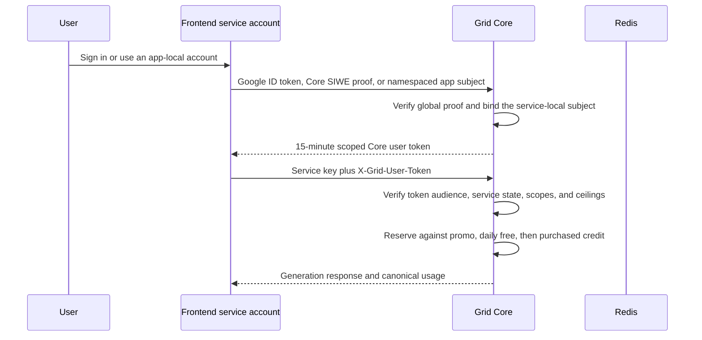

# Universal Grid Accounts

## Status

The Core schema, identity services, native short-lived user tokens, bounded
service clients, wallet-link flow, promotional grants, and three-pocket
reservation accounting are built and tested. They are ship-dark: promotional
and daily-free value do not pay for inference until their independent live
flags are enabled. The legacy internal session bridge is default-off.

## Invariants

1. A Grid account is the billing and ownership principal. A wallet, Google or
   GitHub subject, email, or API key is a credential attached to it, not the account.
2. Wallet and Google identities authenticate only after cryptographic or trusted
   provider proof. Imported email is unverified contact data.
3. Linking never matches on email. Merging requires proof of the destination
   account session and proof of the identity being attached.
4. Historical jobs, worker ledger rows, and payouts are never rewritten.
   Purchased balance moves with paired append-only ledger entries.
5. A merge cannot multiply a campaign grant. Duplicate grants collapse to the
   larger remaining entitlement, never their sum.
6. Promotional, daily-free, and purchased credit are separate pockets. Reserve,
   settle, and refund preserve the originating pocket.
7. A wallet is cheap to create and is not Sybil resistance. The welcome grant
   requires a verified Google identity and is globally budget-capped.

## Frontend flow


```mermaid
sequenceDiagram
    participant U as User
    participant F as Frontend service account
    participant C as Grid Core
    participant R as Redis
    U->>F: Sign in or use an app-local account
    F->>C: Google ID token, Core SIWE proof, or namespaced app subject
    C->>C: Verify global proof and bind the service-local subject
    C-->>F: 15-minute scoped Core user token
    F->>C: Service key plus X-Grid-User-Token
    C->>C: Verify token audience, service state, scopes, and ceilings
    C->>C: Reserve against promo, daily free, then purchased credit
    C-->>F: Generation response and canonical usage
```

The service key remains server-side and has only `account.read`,
`inference.submit`, `identity.exchange`, and transitional app-only
`identity.assert`. A delegated user receives inference and self-balance read
authority, never key, payout, worker, or account-management authority. Native
tokens live for 15 minutes and are audience-bound to an active service.

Compromise of a service can impersonate subjects in that service's app
namespace, but cannot claim a global Google user or wallet without fresh proof
verified by Core. Per-request and daily ceilings cap exposure. A service must
derive `app_subject` from its authenticated server session; accepting an
arbitrary browser value would let a caller target another local account during
a proof-authorized merge. Service-owned jobs remain supported and charge the
service account. External integrators may instead use their own user-held keys.

Legacy signed app assertions used the service account UUID as their namespace;
native exchange uses the stable service id. On first native exchange, Core
resolves both forms, attaches the stable identity to a legacy owner, and
value-conservingly merges a conflict. This prevents an auth upgrade from
splitting an existing app user's balance.

## Product topology

The Grid is one account and economy with several focused interfaces, not one
monolithic frontend:

| Surface | Product role | Canonical identity path |
| --- | --- | --- |
| Console | Account control plane: funding, keys, usage, workers | Direct Google/SIWE Core session |
| aipg.chat | Text, tools, search, and agent workflows | Chat-local subject linked by Google/SIWE |
| aipg.art | Image/video creation and gallery | Gallery-local subject linked by Google/SIWE |
| aipg.music | Music generation and playback | Random signed Music subject linked by Google/SIWE |
| SDK/API | Programmatic use | User API key or delegated Core token |

Navigation and account language should make these feel like one offering, while
each application keeps its modality-specific workflow. Funding, balance,
identity, metering, receipts, and account history are Core-owned. A frontend
must not recreate a separate free-try counter or local paid balance.

## Google OAuth ownership

Production Google identity is owned in Google Cloud project
`aipg-art-486319` (project number `786974751408`) under the `v2v.tech`
organization. The project-wide external, in-production consent app is branded
`AI Power Grid`. It may serve the first-party product domains, but each product
must retain a distinct Web OAuth client:

| Client name | Authorized JavaScript origin | Authorized redirect URI |
| --- | --- | --- |
| `AIPG Art` | `https://aipg.art` | None required by the Google ID-token flow |
| `AIPG Music` | `https://aipg.music` | None required by the Google ID-token flow |
| `AIPG Chat` | `https://aipg.chat` | `https://aipg.chat/auth/oauth/callback` |

The corresponding Core service policy must allow only that client's audience.
Art and Music client IDs are public build-time configuration plus server-side
verification configuration. Chat's client secret is server-only and must never
enter source, frontend bundles, logs, or docs.

Do not point production back at OAuth project number `706974751400`. That
historical project is not accessible to the current operator accounts. A client
migration is complete only after the frontend configuration, server verifier,
and Core service audience all use the new client and a real Google login works
from the production origin.

Partner wallet login is a two-call Core flow. The service requests
`POST /v1/auth/wallet/challenge` with its server-held key, an exact allowlisted
domain and URI, wallet address, Base chain id, and optional server-derived app
subject. The wallet signs Core's returned EIP-4361 message unchanged. The
service forwards it to `POST /v1/auth/wallet/exchange`; Core verifies and
consumes the service-, subject-, wallet-, origin-, and nonce-bound challenge,
then merges or attaches the identities under the invariants below.
EOAs verify locally. Deployed EIP-1271 smart wallets verify against Base and
fail closed when RPC proof is unavailable. Counterfactual ERC-6492 wallets need
an audited universal-signature verifier before they are accepted.

## Wallet linking and merge

`POST /v1/account/identities/wallet/link` accepts the exact signed message:

```text
Link wallet to AIPG Grid account <account UUID>

Nonce: <Core-issued nonce>
```

The session proves the destination account and the signature proves the wallet.
If the wallet already owns an account, Core refuses the merge while either
account has an active value hold, revokes source keys, moves worker ownership,
preserves accrued payout reachability, moves purchased credit with paired ledger
entries, and records an alias plus an append-only security event.

First-party frontends use `POST /v1/account/identities/wallet/link/asserted`
with a service key plus `X-Grid-User-Token`. A recent Core-verified Google token
proves the destination account and the exact message `Link wallet to AIPG Grid
identity` plus a Core nonce proves the wallet. The same merge invariants apply.

Trusted applications may assert a namespaced `app` subject for an authenticated
user who has neither Google nor wallet identity. This creates a stable canonical
account but confers no strong-identity promotional eligibility. Google and SIWE
remain the proof paths for account linking and promotional grants.
Core additionally binds every `app` subject to the authenticated bridge account,
preventing subject collisions across partners even when local IDs match.

## Credit policy

| Pocket | Default | Reset or expiry | Sybil control | Live gate |
| --- | ---: | --- | --- | --- |
| Daily free | $0.01/day | UTC midnight | Verified Google | `GRID_FREE_SPENDABLE_LIVE` |
| AIPG holder bonus | Disabled | N/A | Deferred until non-recyclable | `GRID_FREE_SPENDABLE_LIVE` |
| Welcome promotion | $0.10 once; $500 campaign cap | 30 days | Verified Google plus global budget | Global gate plus exact campaign in `GRID_PROMO_SPENDABLE_CAMPAIGNS` |
| Purchased | Deposited value | None | Payment confirmation | `GRID_CHARGING_MODE` |

Clients must gate generation on `total_spendable_micro`, not preview totals or
frontend-owned counters. `GET /v1/account/credits` reports each pocket and its
active state separately and includes the canonical `account_id`. Partner apps
use that narrow response to prove account and balance together; delegated
tokens do not need access to the broader `/v1/account` key and identity
metadata.

Promotional issuance and spending are separate controls. All issued grants are
visible in `promotional.preview_remaining_micro`; while the rail is dark, the
legacy `promotional.remaining_micro` display also reports that preview value
with `active: false`. Once active, only grants whose exact campaign ID is in
`GRID_PROMO_SPENDABLE_CAMPAIGNS` contribute to `promotional.remaining_micro`
and `total_spendable_micro`, and the global `GRID_PROMO_SPENDABLE_LIVE`
emergency gate must also be enabled. Wildcards are invalid. This permits a
reviewed builder cohort to go live without activating the universal welcome
campaign.

Before rendering a generation estimate, clients call
`POST /v1/account/credits/quote`. The response repeats the same canonical
account and pocket balances, then adds the Core-owned model/modality price,
holder discount, expected promotion → daily → purchased split, and any
shortfall. The call never reserves or moves value. An unpriced request returns
`priced: false` with a null cost; clients must never reinterpret it as free.
The work-submission route remains authoritative if balance changes after the
quote.

The launch default gives wallet-only accounts no automatic value. A holder
could move the same tokens through multiple wallets and collect a naive bonus
repeatedly, so the holder bonus remains zero until qualification uses bonded
stake or a prior-epoch snapshot. Before `GRID_FREE_SPENDABLE_LIVE=1`, also
enforce a network-wide daily subsidy ceiling. Verified Google identity reduces
casual abuse but is not, by itself, a Sybil proof.

Account merges preserve append-only payout and job ledgers on their original
account and wallet identifiers. Canonical account views resolve the complete
alias family so linked users still see that history without rewriting evidence.

## Rollout gates

1. Apply Alembic through `0019` before deploying partner-wallet exchange
   code.
2. Create a distinct bridge key per first-party frontend and store it only in
   server-side secret storage.
3. Provision separate bounded service accounts for Art, Chat, Music, and
   Console. Allow only each app's required providers, Google audiences, and
   exact SIWE domains.
4. Run shadow accounting and compare Core balances with real completed jobs.
5. Remove frontend-owned free counters only after parity.
6. Enable promotional spending with rollback metrics and campaign-budget
   alerts.
7. Add holder anti-recycling and a network-wide daily-free budget, then enable
   daily free spending independently.
8. Keep `GRID_LEGACY_INTERNAL_SESSION_ENABLED=0` and remove
   `GRID_INTERNAL_TOKEN` after rollback windows close.

The Core contract tests
`test_verified_google_account_and_balance_are_shared_across_products`,
`test_verified_wallet_account_and_balance_are_shared_across_products`, and
`test_verified_google_and_wallet_link_to_one_canonical_account` must stay
green. They exchange verified identities through distinct Console, Art, Chat,
and Music clients, prove direct API-key parity, and verify that Google plus
wallet proof resolves to one funded account without multiplying its balance.

## Production parity gate

The intended gate required charging to remain `off` until one human signed into
every surface with the same verified Google identity and, separately, the same
wallet. Production entered a one-account/one-model `allowlist` before the full
receipt set below was retained. Do not expand that cohort or enable free value
until the missing evidence is captured. Capture the following authenticated,
`no-store` responses without recording cookies, service keys, Core user tokens,
Google tokens, or SIWE signatures:

| Surface | Read endpoint | Account field | Purchased balance field |
| --- | --- | --- | --- |
| Console | `GET /api/account/credits` | `account_id` | `paid.balance_usd` |
| aipg.art | `GET /api/credits` | `account_id` | `paid.balance_usd` |
| aipg.music | `GET /api/auth/session` | `accountId` | `paidUsd` |
| aipg.chat | `GET /api/grid/account` | `account_id` | `paid_balance_usd` |

The gate passes only when:

1. All four account IDs are byte-for-byte equal.
2. All four purchased balances are numerically equal before any new job.
3. Art, Music, and Chat each obtained their response through a distinct bounded
   service client; no public shared-demo credential was used.
4. The Google run and wallet run each pass independently. A wallet linked to a
   Google account must resolve to that same canonical ID in both runs.
5. Core remains on the existing one-account/one-model allowlist throughout this
   identity proof; no additional account, service, or model is selected.

Code-level parity is currently proven by the three named Core contract tests and
the consumer-app mismatch tests. Production also has Google, wallet, and
service-app identity events on one canonical account, but those audit events are
not substitutes for the four endpoint responses above. The live gate therefore
remains incomplete.

After parity passes, deliberately fund the existing allowlisted account and run
one minimum-cost successful job through Art, Music, and Chat, waiting for each
durable reservation to settle before starting the next. After every job, all
four read endpoints must converge on the same decreased purchased balance, and
the Core ledger must contain exactly one settled charge for that job. Any
mismatch, stranded hold, duplicate charge, service-owned charge, or
unallowlisted debit fails the canary and requires returning the mode to `off`.
Global `on` remains a separate rollout decision after the complete canary and
observation window.
