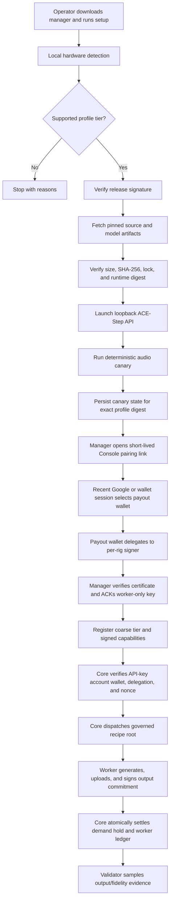

# Worker Profile V1 and ACE-Step Audio

## Posture

The Grid-operated RTX 3090 pilot has completed its one-class, three-run
qualification against an unsigned `pilot` draft. It is not active yet: the
existing offline operator key must sign the final pilot envelope, and Core must
allowlist that final signed digest before the worker can advertise it. Native
enrollment and the authenticated audio route remain dark until that coordinated
activation; demand charging remains off during supervised validation. The
bundled, downloadable `public` profile remains unsigned and marked `draft`, its
three-class qualification is incomplete, and the recipe has not yet been
registered in RecipeVault. A pilot is not a public manager release.

## Purpose

Worker Profile V1 turns installation policy into a signed, reproducible
contract. It helps an honest operator install the exact supported runtime and
prevents accidental capability advertisement before local validation. It does
not prove that an adversarial worker executed the claimed runtime; signed
receipts plus validator evidence remain necessary for that claim.

## Data Flow

## Profile Commitment

The Ed25519-signed profile contains platform rules, hardware thresholds, an
exact ACE-Step commit delivered through a compressed-size/hash/unpacked-size
committed source archive, exact managed Python 3.12.13, the committed `uv.lock`, all model file revisions,
sizes and hashes, the constrained DiT-only audio recipe, Core protocol
compatibility, and post-canary capabilities. The manager bundles `uv`, so this
path does not require system Git. V1 fixes all LM-assisted request modes off.
The profile does not install or initialize the optional 1.7B planner LM. Its
constrained DiT-only request surface keeps planning controls disabled. The
complete runtime model tree contains 21 committed checkpoint files, including
two runtime-effective Python definitions pinned to the exact ACE-Step source
commit. Every file has an exact size and SHA-256 commitment.

`runtime.digest` is SHA-256 over a canonical `aipg-runtime-v1` commitment:

- runtime adapter, model, exact Python patch, CUDA family, and resource policy;
- source artifact kind, URL, revision, compressed size/hash, unpacked size,
  strip policy, and lock hash;
- each Hugging Face artifact revision and exact file manifest;
- governed recipe SHA-256.

The profile digest commits to the entire profile. Core accepts managed profile
metadata only when that exact profile digest is in
`APPROVED_WORKER_PROFILE_DIGESTS`. The empty software default accepts none.

Qualification scope is explicit:

- `pilot` binds one signed profile to one measured hardware class for a
  privately operated, exact-digest Core allowlist entry. It may honestly leave
  `recipe.onchain_root` null and cannot pass public release CI.
- `public` requires minimum, midrange, and datacenter evidence plus the
  registered RecipeVault root before a downloadable manager release can be
  assembled.

The pinned Linux dependency environment measures about 8.28 GB allocated and
the complete 28-file runtime model tree about 10.09 GB (9.40 GiB), for roughly
17.2 GiB before operating headroom. The profile requires 24 GiB free, keeps
managed Python and the `uv` cache on the install-root filesystem, and recommends
32 GiB. Runtime model-hub access is forced offline; source and exact checkpoint
files are revalidated before canary, benchmark, and serving.

## Identity and Privacy

The Grid API key identifies the canonical account. Core derives the payout
wallet from that account; a worker cannot redirect rewards by submitting a
different wallet.

Each rig stores a funds-less secp256k1 worker key (`0600`). The payout wallet
signs a time-bounded EIP-191 delegation naming the worker signer, worker name,
Base chain ID, and Core audience. Every connection includes a fresh registration
nonce signed by the worker key. Redis consumes the nonce once and fails closed
if freshness storage is unavailable.

The manager's `connect` command creates the final API credential and poll secret
locally, sends the credential once over TLS, and opens a short-lived Console
link. Core immediately hashes the credential; neither Redis nor the Console can
retrieve its plaintext. The signed-in operator may use a recent Google or SIWE
session, but still connects and signs with the actual payout wallet. Core
installs only `worker.connect` with a temporary expiry. The manager verifies the
returned certificate against its exact signer, worker name, chain, and audience,
writes private files atomically, and ACKs before Core removes that expiry. The
credential label is enforced at worker registration, so a rig key cannot claim a
different worker name. A successful replacement ACK revokes the prior key for
that same account and rig name.

For a signed release, `grid-media-manager setup` is the primary resumable path:
recommend and bind a GPU, install, launch, benchmark/canary, pair, and enter the
worker loop. Component commands remain recovery and release-qualification tools.
If no worker name is supplied, the manager derives a stable globally unlikely
name from the funds-less rig signer rather than exposing the host name.

On multi-GPU systems, installation records the selected NVIDIA UUID in private
local state and the manager pins `CUDA_VISIBLE_DEVICES` for every canary,
benchmark, and serving process. Release qualification writes a private report
with exact diagnostics and a separate shareable report containing only profile
commitments, coarse tier, and measured performance.

Core receives only a capability tier, profile/runtime/recipe digests, canary
timing, models, and job types. GPU model, exact VRAM, RAM, disk, driver, paths,
and payout private keys remain local.

## Audio Execution Contract

`POST /v1/audio/generations` accepts one prompt, optional lyrics, 10-300 output
seconds, 1-20 inference steps, and an optional seed. Omitted seeds are randomized
by Core; explicit seeds are preserved. Core supplies the governed recipe root,
and the worker rejects a mismatch.

The managed worker only contacts a loopback ACE-Step API. It starts that runtime
with language-model initialization disabled and the signed
`upstream-vram-auto-v1` resource policy, so pinned upstream VRAM detection keeps
CPU offload active where required rather than forcing a 12-16 GB card into an
unsafe no-offload mode. It constrains the request to the signed DiT-only recipe,
downloads output from the same origin, caps output bytes, validates WAV
structure/duration, uploads to a presigned Grid slot, and signs the canonical
output-hash plus recipe-root commitment. Core requires exactly one canonical
SHA-256 result per expected slot and verifies that each bounded WAV object exists
in R2 before signature verification or settlement. This is availability and
size/type evidence, not a claim that Core has recomputed the worker's SHA-256.

Timeouts are deliberately nested:

- worker runtime polling: 1,800 seconds;
- Core worker receive: 1,860 seconds;
- HTTP client wait: 1,920 seconds;
- presigned upload slot: 2,160 seconds (worker deadline plus upload margin).

While media work runs, Core refreshes its Redis pending claim every minute. If
the process dies, heartbeats stop and the existing stale-job reclaimer recovers
the job after the normal media idle window.

## Economic and Chain Boundary

Audio demand reserves exact requested seconds before dispatch and settles only
with the worker ledger terminal transaction. Worker den is calculated from
Core-capped requested seconds, not worker-reported duration. The current
`$0.002/second` customer price and `0.06 den/second` reward weight are provisional
benchmark pegs. Charging remains off through the supervised pilot. Public
hardware support and broad pricing claims still require the full qualification
matrix.

No hot-path transaction belongs in audio generation. The pilot receipt binds
the off-chain recipe SHA-256 and makes no on-chain provenance claim. Before a
public profile ships, register that exact root and canonical recipe bytes in the
live Diamond RecipeVault and record the root in the profile. Aggregate
receipts/epochs can later be anchored on Base. Do not create a new
audio-specific contract for this worker profile.

## Pilot Go-Live Gates

1. Derive a `pilot` draft for the selected hardware class, verify every pinned
   artifact, and run the repeatable three-sample benchmark on that exact GPU.
2. Sign the pilot with an encrypted offline Ed25519 key and commit only its
   public verification key.
3. Add only the final signed profile digest to Core's allowlist. Keep global
   charging off.
4. Complete native Console pairing with a recent Google/SIWE account step-up
   and a real payout-wallet delegation.
5. Run one supervised end-to-end audio job and verify the reservation lifecycle,
   signed receipt, worker ledger row, upload, timeout, and replay behavior.
6. Enable demand charging only after the live price peg and failure/release
   paths are reviewed.

## Public Release Gates

1. Repeat qualification on distinct minimum, midrange, and datacenter NVIDIA
   hosts; record latency, peak resources, output duration, failures, and cost per
   generated second.
2. Register the frozen recipe SHA-256 and canonical recipe bytes in the live
   Diamond RecipeVault through the hardware-wallet path.
3. Sign a separate `public` profile with all three reports and the registered
   root. A pilot profile cannot be promoted or reused as this release.
4. Build Linux and Windows artifacts, verify checksums and provenance, code-sign
   Windows downloads, and perform supervised staging. Treat Apple/MPS as a
   separate future profile.
