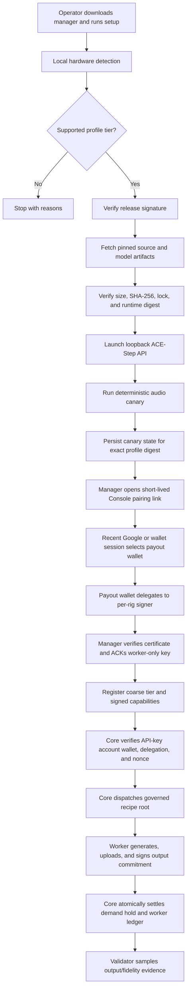

# Worker Profile V1 and ACE-Step Audio

## Posture

This path is ship-dark. Core and worker code exist and tests pass, but the
bundled ACE-Step profile is unsigned and marked `draft`, Core's approved-profile
allowlist is empty, `AUDIO_ENABLED=0`, no production audio worker is connected,
audio charging is off, and the recipe has not been registered in RecipeVault.

## Purpose

Worker Profile V1 turns installation policy into a signed, reproducible
contract. It helps an honest operator install the exact supported runtime and
prevents accidental capability advertisement before local validation. It does
not prove that an adversarial worker executed the claimed runtime; signed
receipts plus validator evidence remain necessary for that claim.

## Data Flow

## Profile Commitment

The Ed25519-signed profile contains platform rules, hardware thresholds, an
exact ACE-Step commit delivered through a compressed-size/hash/unpacked-size
committed source archive, exact managed Python 3.12.13, the committed `uv.lock`, all model file revisions,
sizes and hashes, the constrained DiT-only audio recipe, Core protocol
compatibility, and post-canary capabilities. The manager bundles `uv`, so this
path does not require system Git. V1 fixes all LM-assisted request modes off.
Upstream still requires its default 1.7B LM files to satisfy the main-model
presence check, so those files are pinned but never loaded by this profile. The
complete runtime model tree contains 28 committed files: 26 from the exact model
revision and two runtime-overlaid Python definitions from the exact ACE-Step
source commit. Every file has an exact size and SHA-256 commitment.

`runtime.digest` is SHA-256 over a canonical `aipg-runtime-v1` commitment:

- runtime adapter, model, exact Python patch, CUDA family, and resource policy;
- source artifact kind, URL, revision, compressed size/hash, unpacked size,
  strip policy, and lock hash;
- each Hugging Face artifact revision and exact file manifest;
- governed recipe SHA-256.

The profile digest commits to the entire profile. Core accepts managed profile
metadata only when that exact profile digest is in
`APPROVED_WORKER_PROFILE_DIGESTS`. The current empty default accepts none.

The pinned Linux dependency environment measures about 8.28 GB allocated and
the complete 28-file runtime model tree about 10.09 GB (9.40 GiB), for roughly
17.2 GiB before operating headroom. The profile requires 24 GiB free, keeps
managed Python and the `uv` cache on the install-root filesystem, and recommends
32 GiB. Runtime model-hub access is forced offline; source and exact checkpoint
files are revalidated before canary, benchmark, and serving.

## Identity and Privacy

The Grid API key identifies the canonical account. Core derives the payout
wallet from that account; a worker cannot redirect rewards by submitting a
different wallet.

Each rig stores a funds-less secp256k1 worker key (`0600`). The payout wallet
signs a time-bounded EIP-191 delegation naming the worker signer, worker name,
Base chain ID, and Core audience. Every connection includes a fresh registration
nonce signed by the worker key. Redis consumes the nonce once and fails closed
if freshness storage is unavailable.

The manager's `connect` command creates the final API credential and poll secret
locally, sends the credential once over TLS, and opens a short-lived Console
link. Core immediately hashes the credential; neither Redis nor the Console can
retrieve its plaintext. The signed-in operator may use a recent Google or SIWE
session, but still connects and signs with the actual payout wallet. Core
installs only `worker.connect` with a temporary expiry. The manager verifies the
returned certificate against its exact signer, worker name, chain, and audience,
writes private files atomically, and ACKs before Core removes that expiry. The
credential label is enforced at worker registration, so a rig key cannot claim a
different worker name. A successful replacement ACK revokes the prior key for
that same account and rig name.

For a signed release, `grid-media-manager setup` is the primary resumable path:
recommend and bind a GPU, install, launch, benchmark/canary, pair, and enter the
worker loop. Component commands remain recovery and release-qualification tools.
If no worker name is supplied, the manager derives a stable globally unlikely
name from the funds-less rig signer rather than exposing the host name.

On multi-GPU systems, installation records the selected NVIDIA UUID in private
local state and the manager pins `CUDA_VISIBLE_DEVICES` for every canary,
benchmark, and serving process. Release qualification writes a private report
with exact diagnostics and a separate shareable report containing only profile
commitments, coarse tier, and measured performance.

Core receives only a capability tier, profile/runtime/recipe digests, canary
timing, models, and job types. GPU model, exact VRAM, RAM, disk, driver, paths,
and payout private keys remain local.

## Audio Execution Contract

`POST /v1/audio/generations` accepts one prompt, optional lyrics, 10-300 output
seconds, 1-20 inference steps, and an optional seed. Omitted seeds are randomized
by Core; explicit seeds are preserved. Core supplies the governed recipe root,
and the worker rejects a mismatch.

The managed worker only contacts a loopback ACE-Step API. It starts that runtime
with language-model initialization disabled and the signed
`upstream-vram-auto-v1` resource policy, so pinned upstream VRAM detection keeps
CPU offload active where required rather than forcing a 12-16 GB card into an
unsafe no-offload mode. It constrains the request to the signed DiT-only recipe,
downloads output from the same origin, caps output bytes, validates WAV
structure/duration, uploads to a presigned Grid slot, and signs the canonical
output-hash plus recipe-root commitment. Core requires exactly one canonical
SHA-256 result per expected slot and verifies that each bounded WAV object exists
in R2 before signature verification or settlement. This is availability and
size/type evidence, not a claim that Core has recomputed the worker's SHA-256.

Timeouts are deliberately nested:

- worker runtime polling: 1,800 seconds;
- Core worker receive: 1,860 seconds;
- HTTP client wait: 1,920 seconds;
- presigned upload slot: 2,160 seconds (worker deadline plus upload margin).

While media work runs, Core refreshes its Redis pending claim every minute. If
the process dies, heartbeats stop and the existing stale-job reclaimer recovers
the job after the normal media idle window.

## Economic and Chain Boundary

Audio demand reserves exact requested seconds before dispatch and settles only
with the worker ledger terminal transaction. Worker den is calculated from
Core-capped requested seconds, not worker-reported duration. The current
`$0.002/second` customer price and `0.06 den/second` reward weight are provisional
benchmark pegs; charging must remain off until real minimum, midrange, and
datacenter measurements are reviewed.

No hot-path transaction belongs in audio generation. The near-term receipt
binds the off-chain recipe SHA-256. After benchmark review freezes the recipe,
register that exact root and canonical recipe bytes in the live Diamond
RecipeVault, record the root in the profile, and only then sign and allowlist the
final profile digest. Aggregate receipts/epochs can be anchored on Base. Do not
create a new audio-specific contract for this worker profile.

## Go-Live Gates

1. Run install, launch, canary, and a real Grid job on minimum, midrange, and
   datacenter NVIDIA hosts.
2. Record generation latency, peak VRAM/RAM, output duration, failure behavior,
   and cost per generated second with the manager's repeatable benchmark report;
   use separate state/report files per selected GPU, then adjust requirements,
   timeouts, price, and den. The same verified install root may be reused across
   GPUs without redownloading artifacts.
3. Register the frozen recipe SHA-256 and canonical recipe bytes in the live
   Diamond RecipeVault using the hardware-wallet path, then set the profile's
   `recipe.onchain_root` to that same root.
4. Create an encrypted offline Ed25519 release key. Use `profile_release.py`
   with the three private benchmark reports; it independently recomputes the
   minimum/midrange/datacenter classes and binds only the privacy-safe canonical
   qualification-manifest hash plus the registered root into the final
   `active` profile. Add only the reviewed public key to the worker.
5. Build Linux/Windows artifacts, verify checksums, and code-sign public Windows
   downloads. Treat Apple/MPS as a separate future profile.
6. Add the final profile digest to Core's allowlist and deploy Core dark.
7. Enable the dark Console pairing endpoint in staging and verify Google/SIWE
   step-up, payout-wallet replacement confirmation, manager crash-resume, key
   revocation, and abandoned-enrollment expiry.
8. Run one supervised end-to-end audio job with global charging still off and
   `AUDIO_ENABLED=1`; verify
   reservation, signed receipt, ledger, upload, timeout, and retry behavior.
9. Publish the RecipeVault transaction/reference and supervised job evidence;
   only then consider enabling audio demand charging.
